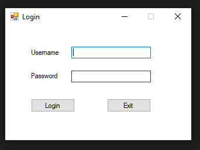
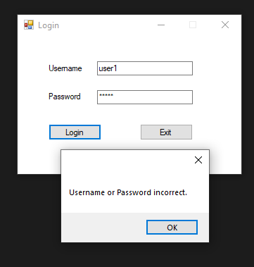

# Login App - C#, SQL, Windows Forms

This is a super simple login program to demonstrate and test functionality of logging into a windows form. A primitive username and password verification is used with the use of a SQL table. There is no security considerations for this program, and it serves as only a basic login.

## Initial Log in form

## Invalid details handling

## Upon valid details entered, opens a separate form

